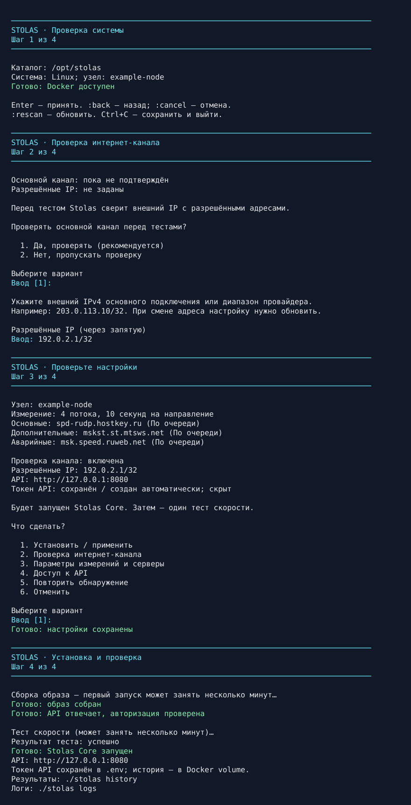

# Интерфейс Stolas v0.5.0

После выбора каталога обычная установка требует три ответа:
проверять ли основной канал, какой внешний IP разрешён, применить ли настройки.
Из сводки можно открыть нужный раздел и изменить параметры.

## Полный диалог

Ниже воспроизводимый снимок **всего диалога** в терминале шириной 80 символов.
Docker и измерение в UI-фикстуре симулированы: это демонстрация интерфейса,
не результат развёртывания на Azazel. CIDR — пример из диапазона документации.
На реальной установке укажите известный внешний IP основного подключения.



Текстовая версия той же сессии:

```text

────────────────────────────────────────────────────────────────────────────────
STOLAS · Проверка системы
Шаг 1 из 4
────────────────────────────────────────────────────────────────────────────────

Каталог: /opt/stolas
Система: Linux; узел: example-node
Готово: Docker доступен

Enter — принять. :back — назад; :cancel — отмена.
:rescan — обновить. Ctrl+C — сохранить и выйти.

────────────────────────────────────────────────────────────────────────────────
STOLAS · Проверка интернет-канала
Шаг 2 из 4
────────────────────────────────────────────────────────────────────────────────

Основной канал: пока не подтверждён
Разрешённые IP: не заданы

Перед тестом Stolas сверит внешний IP с разрешёнными адресами.

Проверять основной канал перед тестами?

  1. Да, проверять (рекомендуется)
  2. Нет, пропускать проверку

Выберите вариант
Ввод [1]:

Укажите внешний IPv4 основного подключения или диапазон провайдера.
Например: 203.0.113.10/32. При смене адреса настройку нужно обновить.

Разрешённые IP (через запятую)
Ввод: 192.0.2.1/32

────────────────────────────────────────────────────────────────────────────────
STOLAS · Проверьте настройки
Шаг 3 из 4
────────────────────────────────────────────────────────────────────────────────

Узел: example-node
Измерение: 4 потока, 10 секунд на направление
Основные: spd-rudp.hostkey.ru (По очереди)
Дополнительные: mskst.st.mtsws.net (По очереди)
Аварийные: msk.speed.ruweb.net (По очереди)

Проверка канала: включена
Разрешённые IP: 192.0.2.1/32
API: http://127.0.0.1:8080
Токен API: сохранён / создан автоматически; скрыт

Будет запущен Stolas Core. Затем — один тест скорости.

Что сделать?

  1. Установить / применить
  2. Проверка интернет-канала
  3. Параметры измерений и серверы
  4. Доступ к API
  5. Повторить обнаружение
  6. Отменить

Выберите вариант
Ввод [1]:
Готово: настройки сохранены

────────────────────────────────────────────────────────────────────────────────
STOLAS · Установка и проверка
Шаг 4 из 4
────────────────────────────────────────────────────────────────────────────────

Сборка образа — первый запуск может занять несколько минут…
Готово: образ собран
Готово: API отвечает, авторизация проверена

Тест скорости (может занять несколько минут)…
Результат теста: успешно
Готово: Stolas Core запущен
API: http://127.0.0.1:8080
Токен API сохранён в .env; история — в Docker volume.
Результаты: ./stolas history
Логи: ./stolas logs
```

## Навигация и совместимость

`:back` возвращает назад; из сводки можно исправить отдельный раздел.
`:rescan` обновляет обнаружение. `:cancel` отменяет до применения и удаляет
черновик; Ctrl+C сохраняет завершённые шаги для повторного запуска.

ANSI-акценты включаются в TTY с подходящим TERM: голубой — этап/ввод,
зелёный — успех, жёлтый — предупреждение, красный — ошибка.
`NO_COLOR`, `TERM=dumb`, отсутствие TTY/ANSI сохраняют тот же текст без цвета.
Длинные значения переносятся; навигация работает при вставке значений.

Реальный Linux PTY-тест в CI проверяет 80 колонок, ошибочный ввод,
возврат назад, пустые строки и ANSI. Артефакт `installer-terminal` содержит
сырой вывод реального псевдотерминала; SVG выше воспроизводится той же фикстурой.

Блокировка установщика, приватные файлы, проверка WAN, nonroot-контейнер,
checksum архива, резервные копии и восстановление сохранены.
Сети Docker, firewall, proxy и сторонние контейнеры автоматически не меняются.

## Управление установленным приложением

`./stolas help` показывает команды. Настройка, обновление, диагностика,
интеграции и удаление используют те же заголовки, цвета и отдельные вопросы.

Удаление сначала показывает каталог, проект, контейнеры, образы и volume.
Далее предлагает сохранить историю, удалить всё или отменить операцию.
Сохранение истории выбрано по умолчанию; для purge нужно ввести `УДАЛИТЬ`.
В CI удаление и диагностика проверяются в настоящем PTY с ANSI и NO_COLOR.
